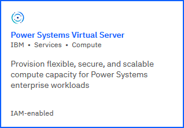
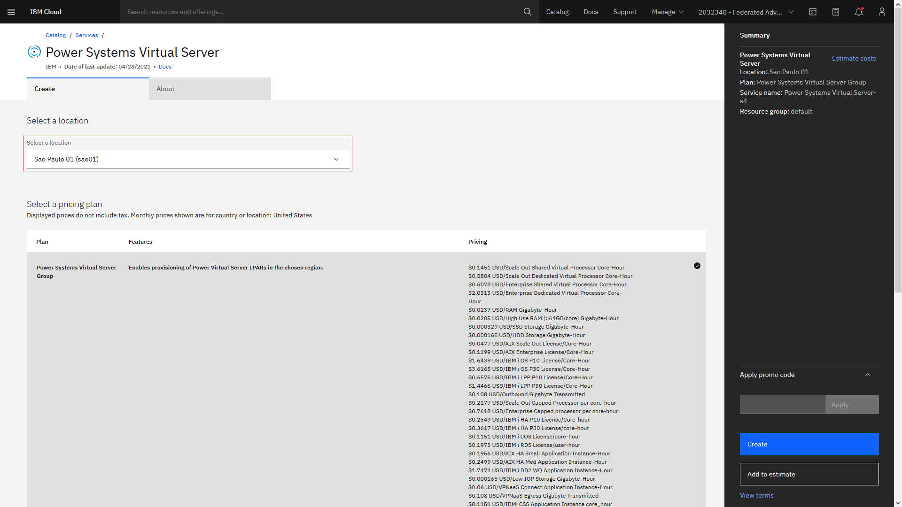
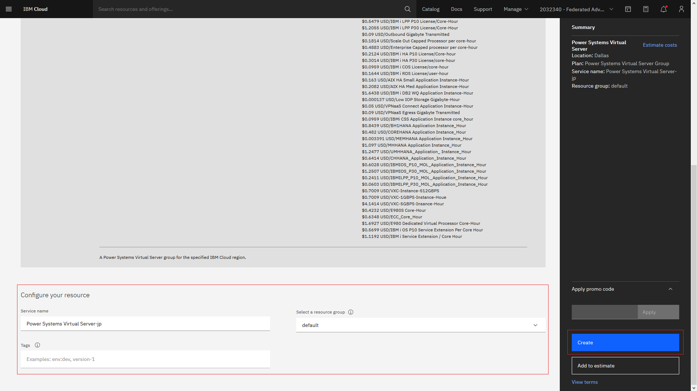
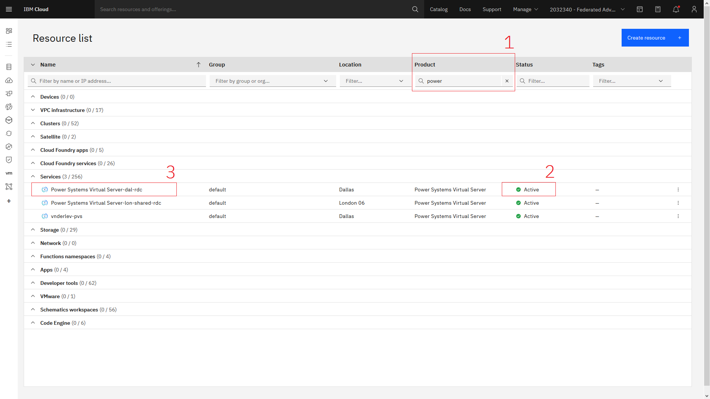
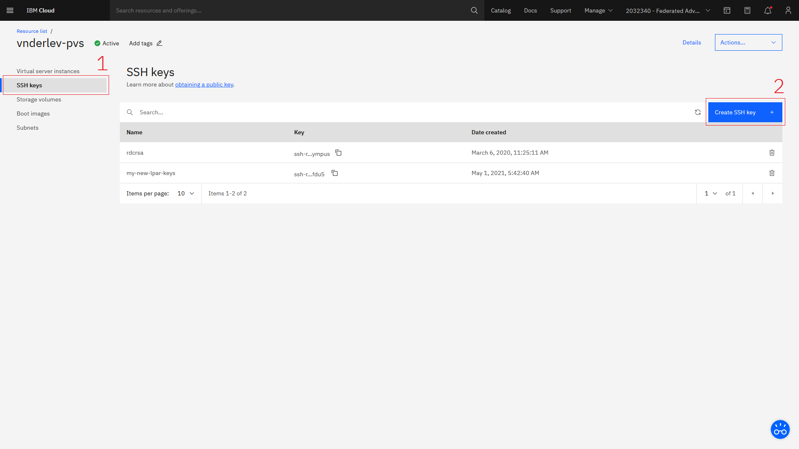
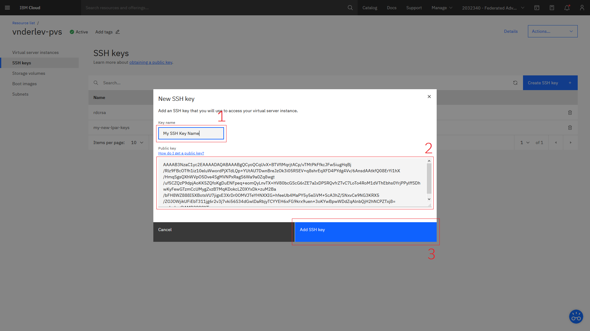
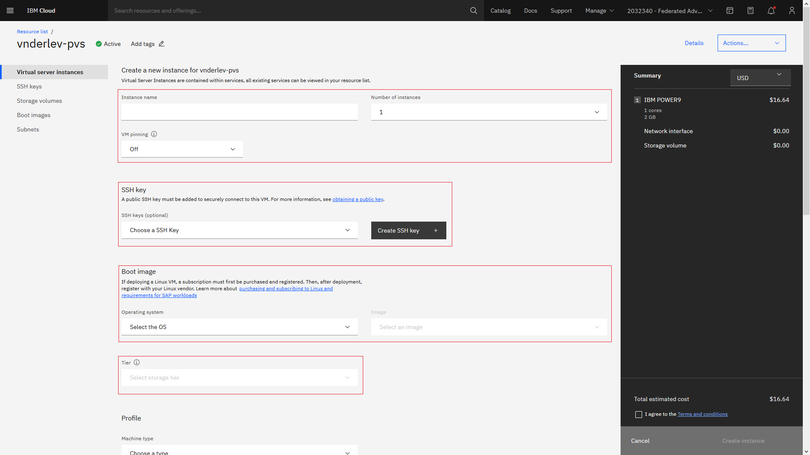

# IBM Power Systems Virtual Servers on IBM Cloud

## Hands-On Lab 1: Provisioning and managing Power Virtual Servers

### Prerequisites

Before you create your first IBM Power Systems Virtual Server instance, review the following prerequisites:

1. [Create an IBM Cloud Account](https://cloud.ibm.com/registration) (must be a *pay-as-you-go* account, as there is no Lite plan for IBM Power Virtual Servers).
2. Review the Identity and Acess management (IAM) information at [Managing Power Systems Virtual Servers (IAM)](https://cloud.ibm.com/docs/power-iaas?topic=power-iaas-managing-resources-and-users).
3. [Install the IBM Cloud Command-Line Interface (CLI) tool](https://cloud.ibm.com/docs/cli?topic=cli-install-ibmcloud-cli).

### Create a Power Systems Virtual Server Group for a specified IBM Cloud Region

- Access the Power Systems VS Group provisioning page in the IBM Cloud Catalog:

[](https://cloud.ibm.com/catalog/services/power-systems-virtual-server)

- Select a location (IBM Cloud Region) for your LPARs from the drop-down menu:



- Overview the only pricing plan available then give a `Service name` and select a `Resource Group` for your IBM Power Systems VS Group. Add `tags` if desired as well, accept the Terms and click on the blue create button on the right-side panel (you will not be charged yet).



- Go to the [IBM Cloud Resource list](https://cloud.ibm.com/resources) and filter services by Product=power. You should be able to see your Power Systems VS Group listed and its status. Wait until your service is **Active** then click on it.



### Generate SSH keys for accessing your Power Virtual Server instances

- You must use the available operating system options to create SSH keys. To generate SSH keys on a Linux or MacOS system, you can use the standard `ssh-keygen` tool to generate SSH keys interactively:

```bash
ssh-keygen
```

- Copy the public SSH key contents (stored in the generated .pub file) to the clipboard:

```bash
cat .ssh/<your_ssh_key_name>.pub
```

- Go to the Power System VS Group page at IBM Cloud Web Console and click on "SSH Keys" on the left-side panel, and then on the blue "Create SSH Key +" button, as shown in the following image:



- Give a name for your SSH Key and paste the copied contents into the "public key" form:



### Creating an AIX VM with the IBM Cloud Web Console

- After creating your SSH key, Click on "Virtual server instances" on the left-side panel, and then on the blue "Create instance +" button on the right side of the screen. You should be redirected to the LPAR creation form:



- Select the desired values for each option. Example:

    - Instance name = `my_aix_vm`
    - Number of instances = `2` (select from the drop-down menu)
    - (Optional) Colocation rules = `No preference` (select from the drop-down menu)
    - (Optional) Naming convention = `Numerical postfix` (select from the radio options)
    - VM pinning = `Off` (select from the drop-down menu)
    - SSH Key = `my-ssh-keys` (select previously created keys from the drop-down menu)
    - Operating system = `AIX` (select from the drop-down menu)
    - Image = `7200-05-01` (select from the drop-down menu)
    - Storage tier = `Tier 3 (3 IOPs / GB)` (select from the drop-down menu)
    - Machine type = `s922` (select from the drop-down menu)
    - Core type = `Shared uncapped` (select from the radio options)
    - Cores (Entitld CPUs) = `1`
    - Memory (GB) = `2`
    - (Optional) Storage volumes [Create volume]:
        - Name = `my-shared-storage`
        - Shareable = `On` (select from the drop-down menu)
        - Size (10GB-2TB) = `10 GB` (select from the drop-down menu)
        - Quantity (create multiple storage volumes at once) = `1`
        - Tier = `Tier 3 (3 IOPs / GB)` (select from the drop-down menu)
    - Network interfaces:
        - Public networks (enable for access from the public internet) = `On`
        - (Optional) Private networks = `None`

### (Optional) Creating an AIX VM with the IBM Cloud CLI

- Log-in at IBM Cloud with the command-line interface:

```bash
ibmcloud login
```

- Make sure you are targeting the correct Cloud Region, Resource Group, and Cloud Foundry Space/Org, example:

```bash
ibmcloud target -r <region> -g <resource_group> --cf
```

- You can optionally list all available IBM Cloud CLI plugings with:

```bash
ibmcloud plugin repo-plugins
```

- Install the `power-iaas` plugin:

```bash
ibmcloud plugin install power-iaas
```

- Verify that the `power-iaas` plugin was installed successfully:

```bash
ibmcloud plugin list
```

- List the IBM Power Systems Virtual Servers services created in your IBM Cloud Region/Resource Group and copy its CRN value:

```bash
ibmcloud pi service-list
```

- Target your previously created IBM Power Systems Virtual Servers service:

```bash
ibmcloud pi service-target <your_service_crn>
```

- (Optional) attach SSH keys to your IBM Power Systems VS service with the IBM Cloud CLI. Copy the contents of a local SSH public key (.pub) file previously generated (if you are on Linux or MacOS you can use the `ssh-keygen` tool to do this):

```bash
cat .ssh/id_rsa.pub
ssh-rsa AAAAB3NzaC1yc2EAAAADAQABAAABAQCtuQnQOc2k4zaGzE7b3xUMCjUy++s/9O9HE4fXSm7UNKoTY39zjQ8mhOwaA3HEo12tOdzdFDYHHWNOYufCcFFk61CAL6HyQGGClib1nFc1xUcgTI9Dee8zzaAsN8mIIr1CgbRELhvOsTv23U4QddpfjkcVoKfF0BAtxgauvooQdPZBoxa2rsD+BvcWnjglkYWG2aBbuzFvSl1fLMihjfej8w1lxbcsYEcJg2X96NJPLmLsEJ+XwoXfVuv0X4z8IoBzZ8UbyTlrDv73EAH34GViYfZFbrIaNnwnz/f/tuOKcINihH72YP+oZn9JeiHQ+hKpMqJAmOK2UIzYr3u+79n9 testkey
```

- (Optional) Use the `key-create` command from `ibmcloud pi` to attach the SSH key to your IBM Power Systems VS Service:

```bash
ibmcloud pi key-create testkey --key "ssh-rsa AAAAB3NzaC
1yc2EAAAADAQABAAABAQCtuQnQOc2k4zaGzE7b3xUMCjUy++s/9O9HE4fXSm7UNKoTY39zjQ8mhOwaA3HEo12tOdzdFDYHHWNOYufCcFFk61CAL6HyQGGClib1nFc1xUcgTI9Dee8zzaAsN8mIIr1CgbRELhvOsTv23U4QddpfjkcVoKfF0BAtxgauvooQdPZBoxa2rsD+BvcWnjglkYWG2aBbuzFvSl1fLMihjfej8w1lxbcsYEcJg2X96NJPLmLsEJ+XwoXfVuv0X4z8IoBzZ8UbyTlrDv73EAH34GViYfZFbrIaNnwnz/f/tuOKcINihH72YP+oZn9JeiHQ+hKpMqJAmOK2UIzYr3u+79n9 testkey"
SSHKey created: testkey
```

- (Optional) To confirm that the key was successfully added, use the following command to list all SSH keys:

```bash
ibmcloud pi keys
```

- Create a Public Network for your Power Virtual Servers instances:

```bash
ibmcloud pi network-create-public <my_public_network_name>

ID                3ae41c6e-af51-4c5e-8488-ee667d8fbb16   
Name              <my_public_network_name> 
Type              pub-vlan   
VLAN              2019   
CIDR Block        192.168.128.184/29   
IP Range          [192.168.128.186192.168.128.190]   
Public IP Range   [52.117.37.186  52.117.37.190  ]   
Gateway           192.168.128.185   
DNS               -
```

- You can now create a new VM with the public key attached by using the following command (replacing the options with your own):

```bash
ibmcloud pi instance-create <my_new_AIX_vm_name> \
    --image 7200-03-03 \
    --memory 2 \
    --networks <my_public_network_name> \
    --processors 1 \
    --processor-type shared \
    --key-name <my_attached_ssh_key_name>

```

You can now wait until the new AIX VM is provisioned.

### Accessing an AIX VM on IBM Power Systems with SSH

- List all VMs created in your IBM Power Systems VS Service and copy the name or ID of the VM you want to access:

```bash
ibmcloud pi instances
```

- Get the External IP address of the previously created AIX VM:

```bash
ibmcloud pi instance <your_AIX_vm_name or ID>
```

- Connect via SSH. Example:

```bash
ssh root@52.117.37.187
Enter passphrase for key '/home/keytest/.ssh/id_rsa':
Last login: Fri Jul 26 16:53:22 CDT 2019 on ssh from 10.150.0.11
*******************************************************************************
*                                                                             *
*                                                                             *
*  Welcome to AIX Version 7.2!                                                *
*                                                                             *
*                                                                             *
*  Please see the README file in /usr/lpp/bos for information pertinent to    *
*  this release of the AIX Operating System.                                  *
*                                                                             *
*                                                                             *
*******************************************************************************
# oslevel -s
7200-03-03-1914
#
```

### IBM Cloud CLI Power IaaS plugin cheat sheet:

```
NAME:
  ibmcloud pi - 

USAGE:
  ibmcloud pi command [arguments...] [command options]

COMMANDS:
  connection, con                      View details of a cloud Connection.
  connection-attach-network, conan     Attach a network to the cloud connection.
  connection-create, conc              Create a cloud connection.
  connection-delete, cond              Delete a cloud Connection.
  connection-detach-network, condn     Detach a network from the cloud connection.
  connection-update, conu              Update the cloud connection.
  connection-vpcs, conv                List all virtual private clouds.
  connections, cons                    List all cloud Connections
  image, img                           View details of an image
  image-create, imgc                   Create a copy of an available stock image into this account; stock image names cannot be changed
  image-delete, imgd                   Delete an image from this account
  image-export, imgex                  Export an image from IBM Cloud Object Storage
  image-import, imgi                   Import an image from IBM Cloud Object Storage
  image-list-catalog, imglc            List images available in the regional image catalog
  images, imgs                         List all images for this account
  instance, in                         View details of a server instance
  instance-attach-network, inan        Attach a network to the server instance
  instance-capture, incap              Capture a server instance
  instance-create, inc                 Create a server instance
  instance-delete, ind                 Delete a server instance
  instance-detach-network, indn        Detach all or a specific network from the server instance.
  instance-get-console, ingc           Get the console of an instance
  instance-hard-reboot, inhrb          Hard Restart the operating system of an instance
  instance-immediate-shutdown, inist   Immediately Shutdown a server instance
  instance-list-volumes, inlv          Get a list of volumes attached to an instance
  instance-networks, inns              List all the attached networks.
  instance-operation, inop             Perform an operation on an IBMi server instance.
  instance-reset-state, inrst          Reset a server instance - use with caution
  instance-soft-reboot, insrb          Soft Restart the operating system of an instance
  instance-start, instr                Start a server instance
  instance-stop, instp                 Stop a server instance
  instance-update, inu                 Update a server instance
  instances, ins                       List all server instances
  key                                  View details of a key
  key-create, keyc                     Create a key with imported RSA public key
  key-delete, keyd                     Delete a key
  key-update, keyu                     Update the name and the value of a SSH key
  keys                                 List all keys
  network, net                         View details of a network
  network-create-private, netcpr       Create a private network
  network-create-public, netcpu        Create a public network
  network-delete, netd                 Delete a network
  network-update, netu                 Update a network
  networks, nets                       List all networks
  sap-create-instance, sapc            Create a new SAP PVM Instance
  sap-list, sapl                       List all SAP profiles for the targeted region
  sap-profile, sapp                    Get the information on a SAP profile
  service-list, sl                     List all services for this account and region
  service-target, st                   Target a service
  snapshot, snap                       Get the detail of a snapshot.
  snapshot-create, snapc               Create a PVM instance snapshot
  snapshot-delete, snapd               Delete a snapshot.
  snapshot-restore, snapr              Restore a PVM instance snapshot
  snapshots, snaps                     List all snapshots
  storage-types, stypes                List all storage types for the targeted region
  system-pool, sysp                    List of available system pools within a particular data center
  task, tsk                            View details of a task.
  task-delete, tskd                    Delete a task.
  volume, vol                          View details of a volume
  volume-attach, volat                 Attach a volume to an instance
  volume-clone, volcl                  Get the status of a clone request for the specified clone task ID.
  volume-create, volc                  Create a volume
  volume-create-clone, volcc           Create a volume clone for specific volumes.
  volume-delete, vold                  Delete a volume
  volume-detach, voldt                 Detach a volume from an instance
  volume-update, volu                  Update a volume
  volumes, vols                        List all volumes
  help, h                              Show help
```